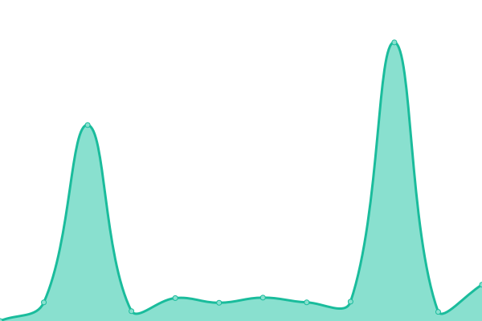
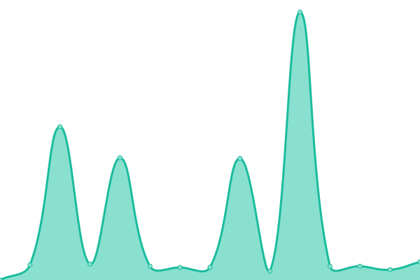
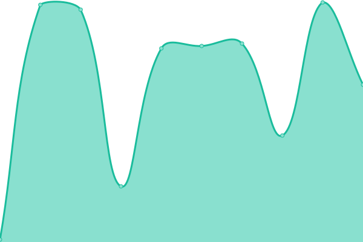

# [📈 Live Status](https://status.ampis.org): <!--live status--> **🟩 All systems operational**

This repository contains the open-source uptime monitor and status page for [Abdullah](https://ampis.org/), powered by [Upptime](https://github.com/upptime/upptime).

With [Upptime](https://upptime.js.org), you can get your own unlimited and free uptime monitor and status page, powered entirely by a GitHub repository. We use [Issues](https://github.com/zer-far/status/issues) as incident reports, [Actions](https://github.com/zer-far/status/actions) as uptime monitors, and [Pages](https://status.ampis.org) for the status page.

<!--start: status pages-->
<!-- This summary is generated by Upptime (https://github.com/upptime/upptime) -->
<!-- Do not edit this manually, your changes will be overwritten -->
<!-- prettier-ignore -->
| URL | Status | History | Response Time | Uptime |
| --- | ------ | ------- | ------------- | ------ |
|  [Website - ampis.org](https://ampis.org) | 🟩 Up | [website-ampis-org.yml](https://github.com/zer-far/status/commits/HEAD/history/website-ampis-org.yml) | 

 234ms
     
 | 

<a href="https://status.ampis.org/history/website-ampis-org">100.00%</a>
    

|  [Allium - tor.ampis.org](https://tor.ampis.org) | 🟩 Up | [allium-tor-ampis-org.yml](https://github.com/zer-far/status/commits/HEAD/history/allium-tor-ampis-org.yml) | 

 2177ms
     
 | 

<a href="https://status.ampis.org/history/allium-tor-ampis-org">99.66%</a>
    

|  [Chat - chat.ampis.org](https://chat.ampis.org) | 🟩 Up | [chat-chat-ampis-org.yml](https://github.com/zer-far/status/commits/HEAD/history/chat-chat-ampis-org.yml) | 

 435ms
     
 | 

<a href="https://status.ampis.org/history/chat-chat-ampis-org">100.00%</a>
    

|  [Calendar - calendar.ampis.org](https://calendar.ampis.org) | 🟩 Up | [calendar-calendar-ampis-org.yml](https://github.com/zer-far/status/commits/HEAD/history/calendar-calendar-ampis-org.yml) | 

 142ms
     
 | 

<a href="https://status.ampis.org/history/calendar-calendar-ampis-org">100.00%</a>
    

|  [Pastebin - pastebin.ampis.org](https://pastebin.ampis.org) | 🟩 Up | [pastebin-pastebin-ampis-org.yml](https://github.com/zer-far/status/commits/HEAD/history/pastebin-pastebin-ampis-org.yml) | 

 119ms
     
 | 

<a href="https://status.ampis.org/history/pastebin-pastebin-ampis-org">100.00%</a>
    

<!--end: status pages-->

[**Visit our status website →**](https://status.ampis.org)

## 📄 License

- Powered by: [Upptime](https://github.com/upptime/upptime)
- Code: [MIT](./LICENSE) © [Abdullah](https://ampis.org/)
- Data in the `./history` directory: [Open Database License](https://opendatacommons.org/licenses/odbl/1-0/)
