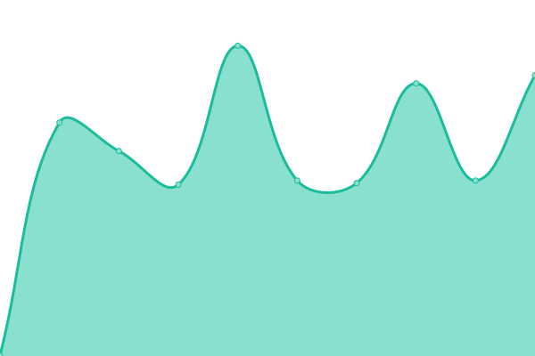

# [📈 Live Status](https://status.ampis.org): <!--live status--> **🟩 All systems operational**

This repository contains the open-source uptime monitor and status page for [Abdullah](https://ampis.org/), powered by [Upptime](https://github.com/upptime/upptime).

With [Upptime](https://upptime.js.org), you can get your own unlimited and free uptime monitor and status page, powered entirely by a GitHub repository. We use [Issues](https://github.com/zer-far/status/issues) as incident reports, [Actions](https://github.com/zer-far/status/actions) as uptime monitors, and [Pages](https://status.ampis.org) for the status page.

<!--start: status pages-->
<!-- This summary is generated by Upptime (https://github.com/upptime/upptime) -->
<!-- Do not edit this manually, your changes will be overwritten -->
<!-- prettier-ignore -->
| URL | Status | History | Response Time | Uptime |
| --- | ------ | ------- | ------------- | ------ |
|  [Website](https://ampis.org) | 🟩 Up | [website.yml](https://github.com/zer-far/status/commits/HEAD/history/website.yml) | 

 292ms
     
 | 

<a href="https://status.ampis.org/history/website">100.00%</a>
    

|  [Allium](https://tor.ampis.org) | 🟩 Up | [allium.yml](https://github.com/zer-far/status/commits/HEAD/history/allium.yml) | 

 638ms
     
 | 

<a href="https://status.ampis.org/history/allium">100.00%</a>
    

|  [PrivateBin](https://bin.ampis.org) | 🟩 Up | [private-bin.yml](https://github.com/zer-far/status/commits/HEAD/history/private-bin.yml) | 

 703ms
     
 | 

<a href="https://status.ampis.org/history/private-bin">100.00%</a>
    

|  [Lstu](https://url.ampis.org) | 🟩 Up | [lstu.yml](https://github.com/zer-far/status/commits/HEAD/history/lstu.yml) | 

 444ms
     
 | 

<a href="https://status.ampis.org/history/lstu">100.00%</a>
    

|  [Jirafeau](https://upload.ampis.org) | 🟩 Up | [jirafeau.yml](https://github.com/zer-far/status/commits/HEAD/history/jirafeau.yml) | 

 471ms
     
 | 

<a href="https://status.ampis.org/history/jirafeau">100.00%</a>
    

|  [Bibliogram](https://bibliogram.ampis.org) | 🟩 Up | [bibliogram.yml](https://github.com/zer-far/status/commits/HEAD/history/bibliogram.yml) | 

 427ms
     
 | 

<a href="https://status.ampis.org/history/bibliogram">100.00%</a>
    

|  [RetroArch](https://retroarch.ampis.org) | 🟩 Up | [retro-arch.yml](https://github.com/zer-far/status/commits/HEAD/history/retro-arch.yml) | 

 593ms
     
 | 

<a href="https://status.ampis.org/history/retro-arch">100.00%</a>
    

|  [SPFToolbox](https://spftoolbox.ampis.org) | 🟩 Up | [spf-toolbox.yml](https://github.com/zer-far/status/commits/HEAD/history/spf-toolbox.yml) | 

 513ms
     
 | 

<a href="https://status.ampis.org/history/spf-toolbox">100.00%</a>
    

<!--end: status pages-->

[**Visit our status website →**](https://status.ampis.org)

## 📄 License

- Powered by: [Upptime](https://github.com/upptime/upptime)
- Code: [MIT](./LICENSE) © [Abdullah](https://ampis.org/)
- Data in the `./history` directory: [Open Database License](https://opendatacommons.org/licenses/odbl/1-0/)
